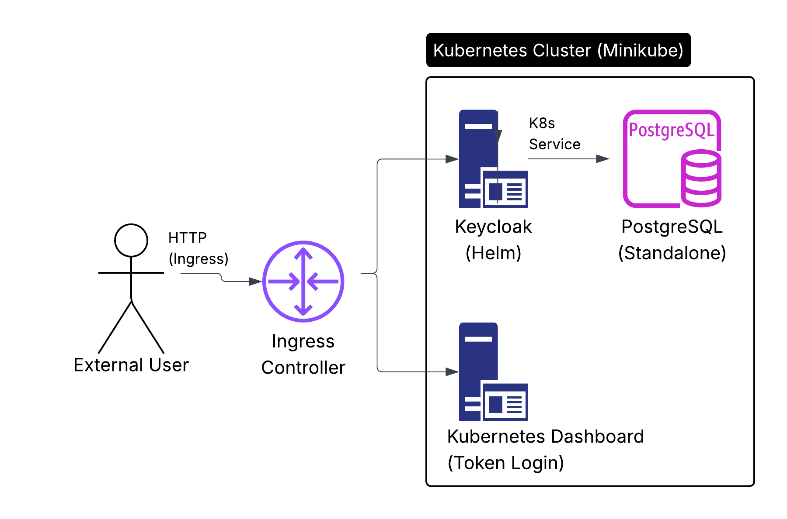

# ✅ DevOps Case Study – To-Do List
This checklist is based on the official task description for the Kubernetes deployment case study.

---

## ⏳ Time Plan (Full Scope – All Bonuses Included)  
This plan reflects the full feature set including all "bonus" tasks as **required work**.  
Time estimates are beginner-friendly and organized to help meet the Sunday deadline.

### 🕒 Estimated Total: **~18–22 hours**  
| Section                        | Est. Time        | Notes |
|-------------------------------|------------------|-------|
| Kubernetes cluster setup      | 2.5–3 hours      | Learn/setup Minikube with Ingress |
| PostgreSQL deployment         | 2–2.5 hours      | Includes PVC, probes, resources |
| Keycloak via Helm             | 3–3.5 hours      | Includes Helm basics, secrets, limits |
| Kubernetes Dashboard          | 1.5–2 hours      | Includes RBAC, Ingress, token login |
| Ingress (NGINX + rules)       | 2–2.5 hours      | Full HTTP config and testing |
| Documentation & diagram       | 3–3.5 hours      | README + Lucidchart architecture |
| Automation script             | 0.5–1 hour       | Bash-based (e.g. `deploy.sh`) |
| TLS + improvement planning    | 1.5–2 hours      | cert-manager + future ideas |
| Final testing + GitHub polish | 1–1.5 hours      | End-to-end test + push |

---

### 📆 Updated 4-Day Plan (Started on Thursday)  
| Day       | Focus Areas                                                    | Est. Time |
|-----------|----------------------------------------------------------------|-----------|
| **Thu**   | ✅ Cluster setup (complete) <br> ✅ PostgreSQL (complete)     | ~3–4 hrs |
| **Fri**   | Keycloak via Helm (external DB, secrets, probes, limits)       | ~4–5 hrs |
| **Sat**   | Dashboard, Ingress, TLS (cert-manager), token login            | ~4–5 hrs |
| **Sun**   | Diagram (Lucidchart), automation script, README polish <br> Final testing & GitHub cleanup | ~6–7 hrs |

---

## 🧱 Objective  
Deploy a complete environment on a **self-managed Kubernetes cluster** consisting of:

- [x] Kubernetes cluster (Minikube with Ingress)
- [x] PostgreSQL (with persistent storage)
- [x] Keycloak (backed by PostgreSQL, not H2)
- [x] Kubernetes Dashboard
- [x] Ingress to expose Keycloak & Dashboard over HTTP 
  - [ ] (HTTPS = bonus)

---

## 🔧 Kubernetes Cluster Setup  
- [x] Create a **single-node Kubernetes cluster** on Linux (WSL2 Ubuntu 24.04.2 LTS)
- [x] Can be installed in a local VM
- [x] Any installation method allowed (Minikube)

---

## 📦 PostgreSQL  
- [x] Deploy PostgreSQL with:
  - [x] PersistentVolumeClaim for storage (stay available after restarts)
  - [x] Standalone container (no bundling with Keycloak)
  - [x] Exposed via internal K8s service

---

## 🧩 Keycloak  
- [x] Deploy standalone Keycloak container
- [x] Use PostgreSQL as its backend (no embedded H2 database)
- [x] Expose Keycloak admin console via web (web browser accessible)
- [ ] Store admin credentials securely (e.g., secret/env)                     # reverted from secret due to deployment issues 

---

## 🖥️ Kubernetes Dashboard  
- [x] Deploy official Kubernetes Dashboard
- [x] Web-accessible via Ingress
- [x] Token-based login

---

## 🌐 Ingress Setup  
- [x] Install and configure Ingress Controller (e.g. NGINX) -> enabled via Minikube
- [x] Create Ingress rules for:
  - [x] Keycloak (e.g. `keycloak.local`)
  - [x] Kubernetes Dashboard (e.g. `dashboard.local`)
- [ ] HTTPS support via cert-manager

---

## 📚 Documentation (README content)
- [x] Describe tested environment (OS, K8s version, etc.) ->  WSL2 Ubuntu 24.04, Minikube, etc. listed
- [x] How to deploy each component -> Covered in each section with Helm and `kubectl` instructions
- [x] Ingress routes (hostnames, ports) & `/etc/hosts` setup -> Explained with `keycloak.local` and `dashboard.local`
- [x] Login instructions for Keycloak admin console and Kubernetes Dashboard -> static credentials defined + token usage
- [x] Explain how components work together:
  - [x] Role of Ingress
  - [x] Keycloak → PostgreSQL link
- [x] Add architecture diagram using **Lucidchart**:
  - Show interaction between components:
    - External user
    - Ingress Controller
    - Keycloak
    - PostgreSQL
    - Kubernetes Dashboard
  - Include arrows to represent traffic flow (HTTP/Ingress, internal service links)
  - Export diagram as PNG and save to `notes/architecture.png`
  - Embed in README with:
    ```md
    
    ```

---

## 🔧 Advanced Configuration Features
- [x] Automation script (e.g. in bash, [`deploy.sh`](deploy.sh))
- [ ] Cross-platform testing & optimization for [`deploy.sh`](deploy.sh)  
  - Verify on native Linux, macOS, and non-Docker environments  
  - Improve driver detection or provide CLI flags  
  - Add fallback messages or better portability where needed
- [x] Optional automation script for Keycloak ([`deploy-keycloak-dashboard.sh`](deploy-keycloak.sh))
  - [ ] Testing
- [x] Use liveness and readiness probes -> Defined in keycloak-values.yaml
- [x] Set resource requests and limits -> Also defined in keycloak-values.yaml
- [ ] Mention future improvements:
  - [ ] TLS support
  - [ ] HA/scaling
  - [ ] Monitoring
  - [ ] Backup strategy

---

## 📤 Final Output
- [x] All manifests in GitHub repo -> manifests and Helm values present
- [x] Clean, readable YAML
- [x] Helm chart(s) for at least one component
  - [x] Keycloak via Bitnami chart with embedded DB disabled and customized values.yaml, with PostgreSQL and Ingress configured manually
- [x] Well-structured README
- [x] Helpful comments or inline notes